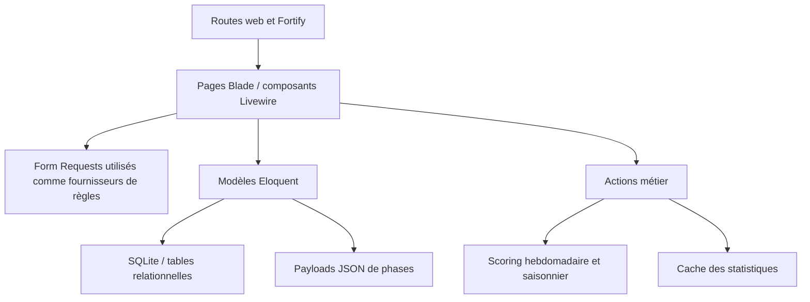

# Analyse du code et recommandations UX

## Résumé exécutif

L’application possède une base fonctionnelle solide: routes nommées, authentification Fortify, composants Flux, validations dédiées, contraintes d’unicité, scoring isolé dans des Actions et 105 tests verts pour 387 assertions. Les principaux risques ne sont pas des défauts de présentation, mais des écarts de contrat métier qui affectent directement la confiance des participants.

Les quatre priorités sont:

1. empêcher la consultation et le scoring des brouillons adverses;
2. donner une vraie échéance à la prédiction de saison;
3. reconstruire correctement candidats, résultats dérivés et scores après une correction;
4. rendre les mutations critiques atomiques et leurs traitements visibles.

La cartographie détaillée est disponible dans [`docs/flows/`](flows/README.md).

## Architecture actuelle

- Le domaine est centré sur `Season`, `Week`, `WeekPhase`, `Houseguest`, `Prediction` et leurs scores.
- Les écrans Livewire orchestrent directement validation, autorisation, écriture, fichiers, recalcul et feedback.
- Les phases hebdomadaires sont dynamiques; leurs sélections sont stockées dans `phase_picks` et `phase_results` en JSON.
- `WeekPhaseManager` centralise configuration, normalisation, migration legacy, libellés et manipulation des payloads. Cette centralisation a limité la duplication métier, mais la classe est devenue un point de couplage très large.
- La plupart des écrans résolvent eux-mêmes la saison active avec la même requête.

## Ce qui est déjà bien conçu

- Les routes participant et administration sont protégées respectivement par `auth` et `can:admin` (`routes/web.php`).
- Les contraintes uniques protègent une prédiction par utilisateur/semaine et utilisateur/saison.
- Les relations critiques utilisent des suppressions en cascade ou `nullOnDelete` dans les migrations.
- Les formulaires distinguent brouillon et confirmation complète.
- Les sélections devenues inactives restent consultables après verrouillage.
- Les listes répétées dans les phases utilisent généralement des clés Livewire; les écrans sont responsive et prévoient le mode sombre.
- Les tests couvrent scoring dynamique, veto utilisé ou non, verrouillage, CRUD admin, authentification, A2F et seeders.

## Recommandations priorisées

| Priorité | Recommandation | Impact utilisateur | Effort |
|---|---|---|---|
| P0 | Politique serveur de révélation des prédictions | Empêche la copie de choix encore modifiables | M |
| P0 | Scorer uniquement les soumissions éligibles | Rétablit l’équité du classement | M |
| P0 | Échéance globale pour la prédiction de saison | Empêche les modifications après connaissance des résultats | M |
| P0 | Reconstruire l’état de saison après correction | Évite candidats absents et scores faux | L |
| P0 | Gérer les utilisateurs archivés dans le classement | Évite une erreur sur une clé utilisateur absente | S |
| P1 | Actions transactionnelles pour les mutations critiques | Évite les états partiellement sauvegardés | L |
| P1 | Rescore et cache après toute correction | Aligne immédiatement succès affiché et classement | M |
| P1 | Recalcul asynchrone avec progression | Évite les écrans figés et doubles lancements | L |
| P1 | Modèle d’état partagé semaine/prédiction | Rend dates, verrouillage et libellés cohérents | M |
| P1 | Confirmation, chargement et protection des formulaires | Réduit erreurs, doubles clics et perte de saisie | M |
| P2 | Découper `WeekPhaseManager` et les formulaires dupliqués | Accélère les évolutions sans régression | L |
| P2 | Accessibilité et responsive des écrans denses | Améliore mobile, clavier et lecteurs d’écran | M |
| P2 | Recherche, filtres et historique de saison | Facilite l’usage régulier et l’administration | M |

### P0. Politique de visibilité et d’éligibilité

Constat:

- `predictions/{user}` est protégé uniquement par `auth` (`routes/web.php:44`).
- Le composant charge toutes les prédictions de l’utilisateur cible sans filtre de confirmation ou de verrouillage (`resources/views/livewire/predictions/⚡show/show.php:45`).
- `ScoreWeek` parcourt toutes les prédictions d’une semaine (`app/Actions/Predictions/ScoreWeek.php:24`).
- `ScoreSeasonPredictions` parcourt toutes les prédictions de saison (`app/Actions/Predictions/ScoreSeasonPredictions.php:23`).

Refactor recommandé:

- Ajouter une Policy ou un service `PredictionVisibility`.
- Le propriétaire et un administrateur peuvent voir le brouillon immédiatement.
- Les autres participants ne voient les choix qu’après verrouillage global de la semaine; appliquer la même règle au serveur et à la requête.
- Définir explicitement le sort d’un brouillon à l’échéance: exclusion du scoring ou auto-soumission atomique. L’exclusion est le choix le plus prévisible.
- Ajouter `whereNotNull('confirmed_at')` au scoring si seules les confirmations comptent.
- Remplacer le test qui affiche actuellement une prédiction non confirmée par une matrice propriétaire/admin/adversaire, avant/après verrouillage.

### P0. Échéance de prédiction de saison

La saison ne possède pas de délai de prédiction; `isLocked` dépend uniquement de `confirmed_at`. Un brouillon peut donc rester modifiable indéfiniment et être scoré.

Refactor recommandé:

- Ajouter `prediction_lock_at` à `seasons`.
- Exposer `Season::predictionsAreLocked()` ou un service d’état.
- Vérifier le délai au montage **et** dans une transaction au moment de sauvegarder/confirmer.
- Afficher un compte à rebours ou une date locale, un état « ferme bientôt », puis le motif du verrouillage.
- Prévoir une action administrative explicite pour rouvrir avec audit, plutôt qu’une modification directe de date silencieuse.

### P0. Reconstruction déterministe après correction

À l’enregistrement d’un résultat, seuls les nouveaux éliminés sont désactivés (`admin/weeks/⚡outcome/outcome.php:83`). Si le résultat est corrigé, l’ancien éliminé n’est pas réactivé. Le calcul saisonnier ne remet pas à `null` les valeurs qui ne peuvent plus être dérivées et ne détecte le premier éliminé que durant la semaine 1.

Refactor recommandé:

- Créer `RebuildSeasonState` dans une transaction.
- Repartir de tous les candidats de la saison, rejouer chronologiquement tous les résultats et recalculer `is_active`, premier éliminé, Top 6 et gagnant.
- Persister aussi les valeurs nulles afin d’effacer les résultats devenus obsolètes.
- Formaliser les doubles évictions et le passage de plus de six à moins de six candidats.
- Recalculer ensuite les scores à partir de cet état canonique.

### P0. Classement et comptes supprimés logiquement

L’administration appelle `delete()` sur un modèle `User` utilisant `SoftDeletes`. Les scores restent présents, alors que le classement recharge les utilisateurs sans `withTrashed()` puis accède directement à `$users[$userId]`.

Refactor recommandé:

- Décider le contrat produit: conserver l’historique avec badge « compte archivé », ou exclure explicitement ses scores.
- Pour préserver le classement historique, charger `withTrashed()` et afficher un nom figé ou l’utilisateur archivé.
- Ajouter un test d’ouverture du classement après suppression logique d’un participant scoré.

### P1. Actions métier transactionnelles

Les parcours suivants font plusieurs écritures sans transaction globale:

- activation de saison et désactivation des autres;
- sauvegarde semaine, synchronisation des phases et réconciliation des payloads;
- confirmation de prédiction;
- résultat hebdomadaire, statut des candidats, résultat dérivé, scores et cache;
- remplacement d’avatar et suppression de l’ancien fichier.

Extraire des Actions telles que `ActivateSeason`, `SaveWeekDefinition`, `SubmitWeekPrediction`, `RecordWeekOutcome` et `CorrectPrediction`. Elles doivent:

1. autoriser;
2. recharger les entités sous `lockForUpdate()` lorsque le temps ou l’unicité compte;
3. valider l’état métier;
4. écrire dans `DB::transaction()`;
5. lancer recalcul et invalidation après commit;
6. retourner un résultat présentable à Livewire.

### P1. Rescore immédiat et cache cohérent

La correction admin d’une prédiction enregistre le payload et l’audit, puis affiche « Enregistré » sans recalculer le score (`admin/predictions/⚡edit/edit.php:51`). La modification des phases réécrit également les payloads sans rescore (`admin/weeks/⚡index/index.php:229`).

Refactor recommandé:

- Publier un événement métier après chaque mutation susceptible d’affecter le score.
- Un listener/service idempotent rescore la semaine et la saison concernées.
- Centraliser l’invalidation de `BuildDashboardStats` dans le même pipeline.
- Afficher « Mise à jour des scores en cours » puis la dernière date de calcul.

### P1. Recalcul asynchrone et observable

`RecalculateAllScores` parcourt semaines puis prédictions dans la requête Livewire. Avec la croissance du pool, le bouton semblera figé et peut être cliqué plusieurs fois.

Refactor recommandé:

- Créer un Job unique par saison, idempotent et lancé après commit.
- Persister un statut `queued/running/completed/failed`, la progression et le résumé.
- Désactiver le bouton pendant l’exécution, afficher `wire:loading`, la dernière réussite et une erreur exploitable.
- Garder une commande Artisan synchrone pour l’exploitation et les tests.

### P1. Modèle d’état partagé

`Week::isLocked()` tient compte du verrou manuel et de `auto_lock_at`, mais `starts_at`, `ends_at` et `locked_at` ne participent pas réellement au parcours. La route « semaine courante » choisit la première semaine non verrouillée même si elle n’a pas commencé.

Refactor recommandé:

- Introduire un enum d’état calculé: `Upcoming`, `Open`, `ClosingSoon`, `Locked`, `Published`.
- Centraliser `canEdit`, `canConfirm`, `canReveal` et `currentWeek`.
- Utiliser les mêmes états dans la route, les composants, le scoring et les libellés.
- Permettre la consultation des saisons passées via une route saisonnée; la saison active devient le défaut, pas l’unique contexte.

### P1. Feedback et prévention des erreurs

Les formulaires de prédiction ont deux actions, mais ni récapitulatif avant le verrouillage, ni progression, ni état de chargement. Le message de succès commun disparaît après deux secondes.

Refactor recommandé:

- Dialogue Flux de confirmation avec résumé des choix et texte irréversible.
- Barre de progression « sélections complètes / attendues » et validation à la volée ciblée.
- `wire:dirty` pour signaler les modifications non enregistrées et protéger la navigation.
- `wire:loading.attr="disabled"`, libellé d’action en cours et skeletons pour les traitements longs.
- Toast ou callout accessible avec région `aria-live`, conservé assez longtemps.
- Pour le Top 6, utiliser un composant ordonné qui retire les candidats déjà choisis des options restantes.

## Refactors structurels

### Découper la gestion des phases

`WeekPhaseManager` cumule trop de raisons de changer. Proposition:

- `WeekPhaseType` enum pour types et libellés;
- DTO `PhaseDefinition` et `PhaseSelection`;
- `NormalizePhasePayload`;
- `ReconcilePhasePayload`;
- `CalculateWeekScore`;
- `LegacyPhasePayloadMapper`, supprimable après la migration définitive.

Les callbacks `saving` des modèles interrogent actuellement le schéma et résolvent un service pour supporter les anciennes colonnes. Une fois la migration confirmée partout, retirer ce comportement caché améliorera lisibilité et performance.

### Livewire Form Objects et composants Blade

Les formulaires hebdomadaires participant, résultat admin et correction admin répètent la normalisation du veto et presque le même rendu de phase. La prédiction de saison répète également sauvegarde et confirmation.

- Utiliser des Livewire Form Objects pour l’état et les règles propres à l’écran.
- Extraire un composant Blade/Flux de champs de phase partagé, sans y déplacer l’autorisation.
- Garder les mutations dans les Actions métier.
- Remplacer les clés dynamiques basées sur l’index par un identifiant stable/UUID.

### Saison active

Créer un scope `Season::active()` et un resolver `CurrentSeason`. Il doit détecter une configuration incohérente de plusieurs saisons actives au lieu de masquer le problème avec `first()`.

### Classement

Remplacer les chargements complets et refiltrages en mémoire par des agrégats SQL/Eloquent groupés. Ajouter une règle d’égalité stable, une ventilation semaine/saison et la date du dernier calcul. La pagination devient nécessaire si le nombre de participants augmente.

## Accessibilité et responsive

- La grille candidats du tableau de bord commence à quatre colonnes sur mobile (`dashboard.blade.php:16`); commencer à deux puis augmenter progressivement.
- Les cartes candidats admin sont focusables mais ne répondent pas à Enter/Espace.
- La bascule TOTP/code de récupération utilise des `span` cliquables plutôt que des boutons.
- Ajouter captions ou libellés accessibles aux tableaux, graphiques et boutons icône.
- Corriger la grille utilisateur `grid-cols-2` / `col-span-10`.
- Utiliser davantage les composants Flux Table, Callout, Toast et Modal déjà disponibles pour uniformiser focus, feedback et responsive.

## Validation, fichiers et dates

- Ajouter `after_or_equal`/`after` entre début et fin des saisons et semaines.
- Restreindre explicitement les avatars à JPEG/PNG/WebP, dimensions et poids adaptés.
- Stocker le nouveau fichier, sauvegarder la base, puis supprimer l’ancien après commit; nettoyer aussi les avatars lors des suppressions.
- Bloquer la suppression définitive d’un candidat référencé dans des payloads JSON et proposer la désactivation. À terme, normaliser les sélections dans des tables relationnelles pour obtenir des clés étrangères et des requêtes auditables.

## Stratégie de livraison recommandée

### Lot 1 — Équité et intégrité

- Politique de visibilité.
- Scoring des seules soumissions éligibles.
- Échéance saisonnière.
- Correction déterministe des candidats/résultats.
- Classement avec comptes archivés.

### Lot 2 — Cohérence des mutations

- Actions transactionnelles.
- Rescore et cache centralisés.
- Tests de concurrence autour des échéances.
- Blocage/versionnement des phases après première confirmation.

### Lot 3 — Expérience participant

- Statut de confirmation dans la liste des semaines.
- Compte à rebours, progression, résumé de confirmation, états loading/dirty.
- Détail de score compréhensible et politique de publication claire.

### Lot 4 — Expérience admin et maintenance

- Job de recalcul avec progression.
- Recherche/filtres/pagination et historique de saisons.
- Découpage de `WeekPhaseManager`, Forms et composants partagés.
- Accessibilité clavier et responsive.

## Tests à ajouter avant refactor

1. Brouillon visible par propriétaire/admin mais invisible à un adversaire.
2. Révélation après verrouillage et comportement de la prédiction de saison.
3. Brouillons exclus du scoring.
4. Course entre confirmation et `auto_lock_at`.
5. Correction d’une éviction réactivant l’ancien candidat et désactivant le nouveau.
6. Recalcul effaçant gagnant/Top 6/premier éliminé devenus invalides.
7. Classement après suppression logique d’un utilisateur scoré.
8. Correction admin déclenchant score et cache à jour.
9. Modification ou retrait de phases avec prédictions confirmées.
10. Accès direct refusé à une semaine d’une saison inactive.
11. Utilisateur non vérifié refusé au tableau de bord si ce contrat est retenu.
12. Rollback complet sur échec au milieu d’une mutation multi-étapes.

## État de la suite et conventions

- Commande exécutée: `php artisan test --compact`.
- Résultat: **105 tests réussis, 387 assertions**.
- La suite existante utilise Pest via `tests/Pest.php`, alors que les instructions du dépôt demandent désormais des classes PHPUnit. Il faut choisir une convention et l’appliquer aux nouveaux tests; une conversion progressive évitera deux styles concurrents.
- Le runtime local vérifié est Laravel 12.50.0, Livewire 4.1.3 et PHPUnit 11.5.50. Les métadonnées retournées par le serveur Laravel Boost étaient incohérentes avec ce dépôt; sa connexion/configuration devrait être vérifiée avant de lui confier des diagnostics de version.

