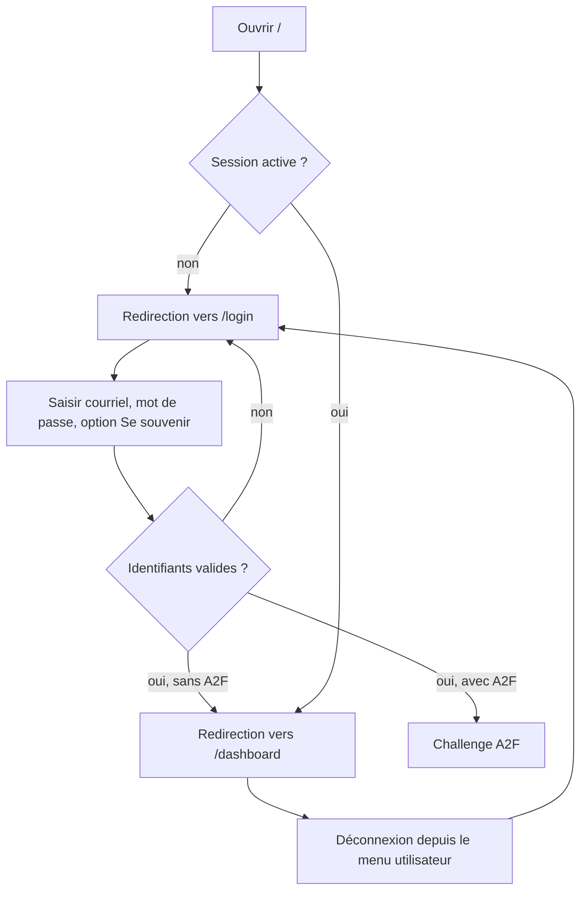

# Accueil, connexion et déconnexion

**Acteur** : visiteur ou utilisateur authentifié.

**Entrées** : `/`, `/login`, action `POST /logout`.

## Parcours nominal

## Règles et branches

- La connexion est limitée à cinq tentatives par minute pour la combinaison courriel/adresse IP.
- Un utilisateur avec A2F active passe par le [challenge A2F](04-challenge-connexion-a2f.md).
- Le menu utilisateur existe en variantes bureau et mobile.
- Les visiteurs authentifiés sont redirigés hors des écrans de connexion et d’inscription.

## États terminaux

- Session authentifiée et redirection vers le tableau de bord.
- Retour à la connexion après déconnexion.
- Erreurs de validation ou d’authentification affichées sur le formulaire.

## Écarts UX observés

- Le bouton de connexion ne présente pas d’état de traitement; un double envoi reste visuellement possible.
- La navigation de déconnexion est dupliquée dans les variantes bureau et mobile.
- La page ne propose pas de message spécifique lorsque le compte a été supprimé logiquement par un administrateur.

## Sources et couverture

- `routes/web.php`, route `home`.
- `app/Providers/FortifyServiceProvider.php`.
- `resources/views/livewire/auth/login.blade.php`.
- `resources/views/components/layouts/app/sidebar.blade.php`.
- `tests/Feature/Auth/AuthenticationTest.php`, `tests/Feature/HomeRedirectTest.php`.

