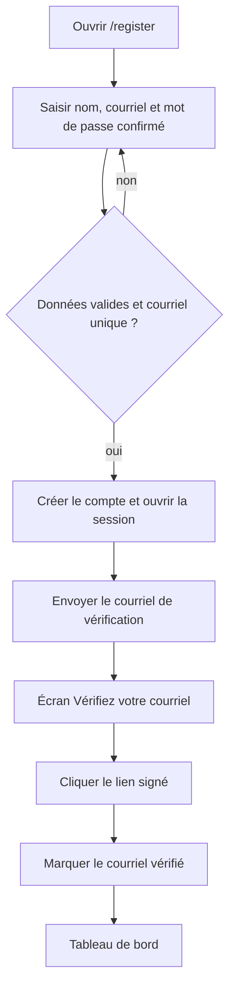

# Inscription et vérification de l’adresse courriel

**Acteur** : visiteur.

**Précondition** : aucune session authentifiée.

## Parcours nominal attendu

## Comportement réellement observé

- Fortify active l’inscription et la vérification du courriel.
- La route du tableau de bord utilise le middleware `verified`.
- Le modèle `User` **n’implémente toutefois pas** `MustVerifyEmail`; l’import est commenté. La vérification n’est donc pas imposée de manière cohérente et l’interface de profil ne montre pas l’état non vérifié.

## Branches

- Courriel déjà utilisé ou mot de passe invalide : retour au formulaire avec erreurs.
- Lien expiré/invalide : la vérification échoue.
- Depuis l’écran d’attente : renvoyer le courriel ou se déconnecter.
- Changer de courriel depuis le profil remet `email_verified_at` à `null`.

## Écarts UX observés

- Le parcours attendu et le contrat du modèle divergent, ce qui peut laisser entrer un compte non vérifié sans explication.
- Aucun état de chargement sur l’inscription ou le renvoi du courriel.
- Le message de succès du renvoi ne rappelle pas l’adresse ciblée ni le délai d’expiration.

## Sources et couverture

- `config/fortify.php`.
- `app/Models/User.php`.
- `resources/views/livewire/auth/register.blade.php` et `verify-email.blade.php`.
- `tests/Feature/Auth/RegistrationTest.php`, `EmailVerificationTest.php`.

