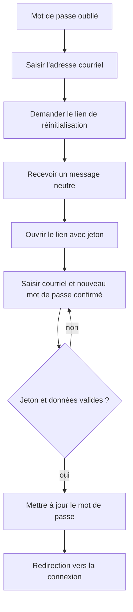

# Récupération du mot de passe

**Acteur** : visiteur qui ne peut plus se connecter.

## Parcours

## Branches et sécurité

- Le formulaire de demande passe par le broker de mots de passe Fortify.
- Le formulaire final contient le jeton signé dans un champ caché.
- Les mêmes règles de mot de passe sont utilisées à l’inscription et à la réinitialisation.

## Écarts UX observés

- Le courriel saisi n’est pas restauré avec `old('email')` sur le premier formulaire après une erreur.
- Aucun état de traitement sur les deux soumissions.
- Le parcours ne donne pas de voie explicite vers le support lorsque le courriel n’arrive pas.

## Sources et couverture

- `resources/views/livewire/auth/forgot-password.blade.php`.
- `resources/views/livewire/auth/reset-password.blade.php`.
- `app/Actions/Fortify/ResetUserPassword.php`.
- `tests/Feature/Auth/PasswordResetTest.php`.

