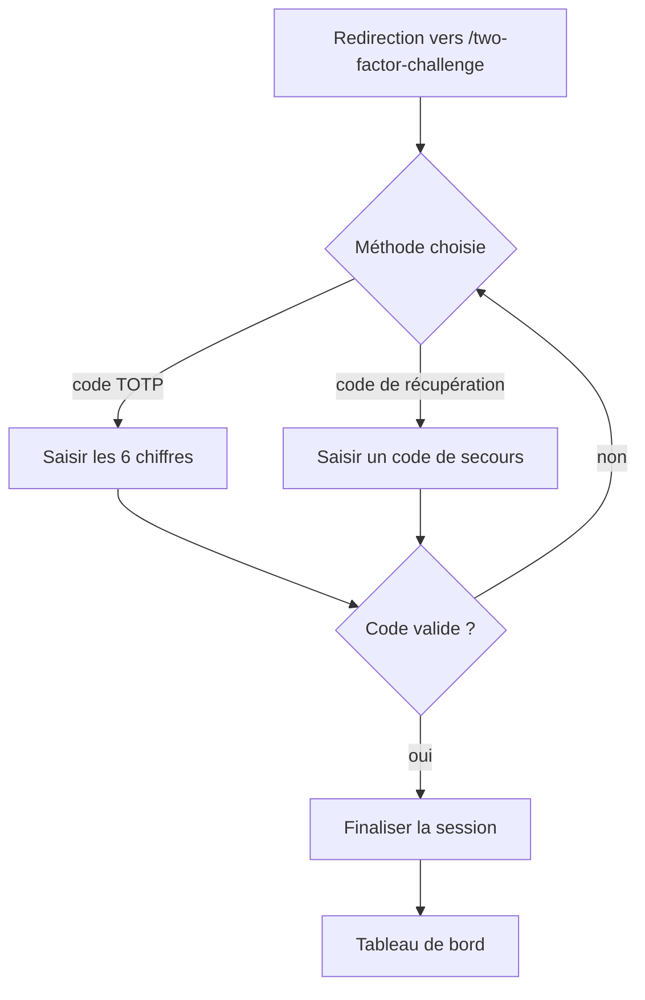

# Challenge de connexion A2F

**Acteur** : utilisateur dont l’authentification à deux facteurs est active.

**Précondition** : identifiants principaux déjà validés.

## Parcours

## Branches

- L’utilisateur peut basculer entre code d’authentification et code de récupération.
- Les champs de la méthode abandonnée sont vidés lors du basculement.
- Le challenge est limité à cinq tentatives par minute.

## Écarts UX observés

- Le lien de bascule est un `span` cliquable et non un bouton; l’activation clavier et la sémantique accessible sont insuffisantes.
- Le bouton Continuer reste actif avant la saisie complète et n’affiche pas d’état de chargement.
- Aucune aide contextuelle n’explique où retrouver les codes de récupération.

## Sources et couverture

- `resources/views/livewire/auth/two-factor-challenge.blade.php`.
- `app/Providers/FortifyServiceProvider.php`.
- `tests/Feature/Auth/TwoFactorChallengeTest.php`, `AuthenticationTest.php`.

