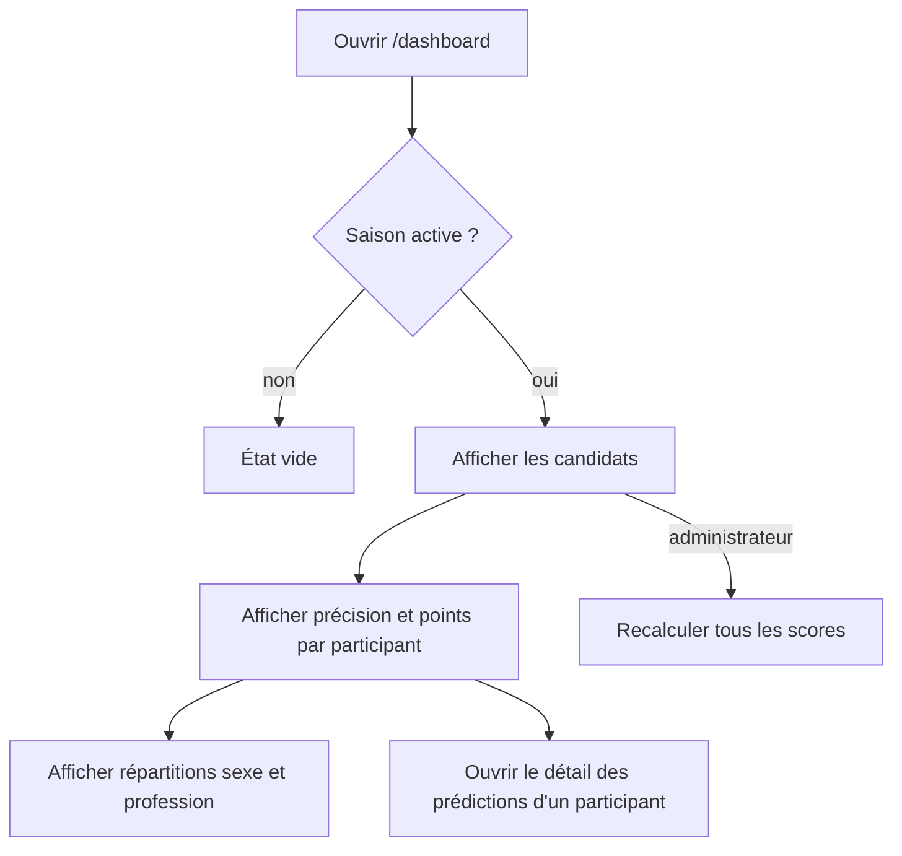

# Consulter le tableau de bord

**Acteur** : utilisateur authentifié; l’administrateur voit une action additionnelle.

## Parcours

## Données et états

- Les statistiques sont mises en cache cinq minutes hors environnement de test.
- Seules les semaines ayant un résultat et un maximum de points calculable participent à la précision.
- Une série d’au moins deux semaines produit un mini graphique.
- Les candidats inactifs restent visibles en niveaux de gris.

## Écarts UX observés

- La grille impose quatre colonnes dès le plus petit écran, ce qui comprime les portraits sur mobile.
- Les graphiques n’ont ni libellé de semaine ni alternative textuelle détaillée.
- La précision agrège uniquement les scores existants; elle ne distingue pas absence de prédiction, brouillon et score nul.
- Le cache est invalidé par plusieurs résultats, mais pas centralement par toutes les mutations capables de modifier l’affichage.

## Sources et couverture

- `app/Actions/Dashboard/BuildDashboardStats.php`.
- `resources/views/dashboard.blade.php`.
- `resources/views/components/houseguest-card.blade.php`.
- `tests/Feature/DashboardStatisticsTest.php`, `DashboardShowsHouseguestCardsTest.php`.

