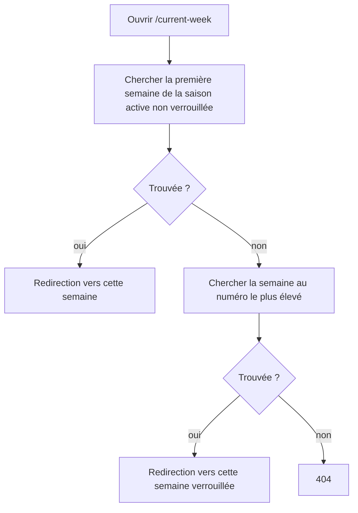

# Atteindre la semaine courante

**Acteur** : participant authentifié.

**Entrées** : bouton « Semaine en cours » depuis `/weeks`, route `/current-week`.

## Algorithme actuel

## Règles réellement utilisées

- Une semaine est ouverte si `is_locked` vaut faux et si `auto_lock_at` est absent ou futur.
- `starts_at` et `ends_at` ne participent pas au choix.
- S’il n’existe aucune semaine ouverte, la dernière semaine par numéro est utilisée.

## Écarts UX observés

- Une semaine future peut être choisie avant sa date de début.
- « Semaine courante » peut mener vers une semaine passée et verrouillée sans expliquer le repli.
- Le bouton reste visible en l’absence de saison ou de semaine et mène alors à une 404.
- La logique de sélection est dans la route au lieu d’un objet métier testable et réutilisable.

## Sources et couverture

- `routes/web.php`, route `current-week`.
- `app/Models/Week.php::isLocked()`.
- `tests/Feature/WeekLockingTest.php`.

