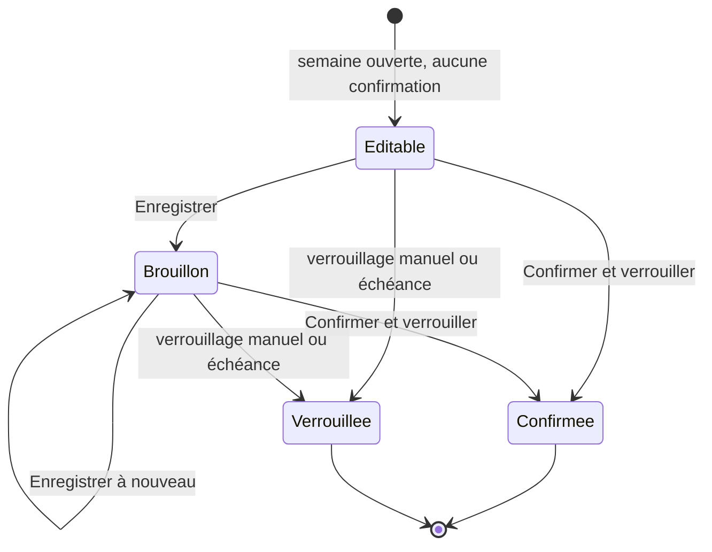

# Saisir et confirmer une prédiction hebdomadaire

**Acteur** : participant authentifié.

**Préconditions** : semaine existante dans une saison et au moins un candidat actif.

## Parcours

## Étapes

1. Ouvrir `/weeks`, consulter le statut ouvert/verrouillé, puis choisir une semaine.
2. Le composant crée les phases par défaut si elles sont absentes.
3. Remplir les sélections de chaque phase; les champs « sauvé » et « remplaçant » apparaissent uniquement si le veto est utilisé.
4. **Enregistrer** accepte un brouillon incomplet.
5. **Confirmer et verrouiller** exige toutes les sélections requises et rend la prédiction non modifiable.
6. Une sélection devenue inactive reste visible lorsque la prédiction est verrouillée.

## Écarts UX et métier observés

- La confirmation irréversible est immédiate, sans écran récapitulatif ni dialogue de confirmation.
- Aucun compteur de progression, avertissement de champs incomplets, échéance visible ou protection contre la perte de modifications.
- La liste des semaines masque volontairement le statut de confirmation du participant.
- Les boutons n’ont pas d’état `wire:loading`, ce qui autorise des clics répétés visuellement.
- Le calcul des scores ne filtre pas `confirmed_at`; un brouillon peut donc être scoré après la saisie du résultat.
- Les écritures de sauvegarde/confirmation ne sont pas regroupées dans une action transactionnelle avec contrôle de concurrence.

## Sources et couverture

- `resources/views/livewire/weeks/⚡index/` et `weeks/⚡show/`.
- `app/Http/Requests/Weeks/SaveWeekPredictionRequest.php` et `ConfirmWeekPredictionRequest.php`.
- `app/Actions/Predictions/ScoreWeek.php`.
- `tests/Feature/WeekLockingTest.php`, `WeekPredictionCanConfirmWhenVetoNotUsedTest.php`, `WeeklyPredictionPhasesIndependentTest.php`.

