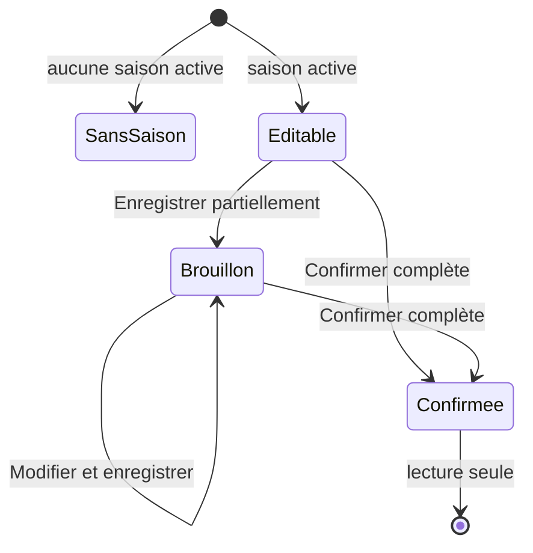

# Saisir et confirmer une prédiction de saison

**Acteur** : participant authentifié.

## Parcours

## Étapes et règles

- Choisir le gagnant, le premier éliminé et six candidats distincts pour le Top 6.
- Le brouillon accepte des valeurs manquantes.
- La confirmation exige les huit sélections et verrouille définitivement la fiche.
- Les candidats inactifs déjà choisis restent chargés sur une fiche confirmée.
- Aucun délai de saison n’est évalué; seule la confirmation personnelle verrouille la fiche.

## Écarts UX et métier observés

- La confirmation irréversible n’a pas de récapitulatif ni de confirmation secondaire.
- Le formulaire ne montre pas la progression « x/8 » ni les doublons avant la validation serveur.
- Les six listes Top 6 demandent beaucoup de balayage et n’empêchent pas visuellement de rechoisir un candidat déjà utilisé.
- Les scores de saison sont calculés pour toutes les lignes, sans filtre `confirmed_at`; un brouillon peut entrer au classement.
- La page « retour » mène aux semaines, relation de navigation peu naturelle pour une prédiction de saison.

## Sources et couverture

- `resources/views/livewire/⚡season-prediction/`.
- `app/Http/Requests/SeasonPrediction/`.
- `app/Actions/Predictions/ScoreSeasonPredictions.php`.
- `tests/Feature/SeasonPredictionTest.php`, `SeasonPredictionSelectAllowsFirstHouseguestTest.php`.

