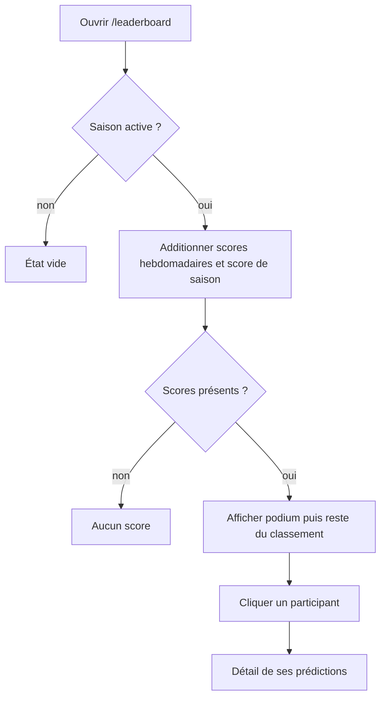

# Consulter le classement

**Acteur** : utilisateur authentifié.

## Parcours

## Données

- Les participants apparaissent dès qu’ils possèdent au moins un score hebdomadaire ou saisonnier.
- Le tri est décroissant sur le total.
- Les trois premiers ont une présentation de podium; les autres une liste compacte.

## Écarts UX observés

- Aucun traitement explicite des égalités: deux totaux identiques reçoivent tout de même des places différentes.
- Le classement ne détaille pas la composante saison, les semaines, la dernière mise à jour ou la règle de points.
- Les requêtes utilisent directement `DB::table`, tandis que le reste du domaine expose des modèles et relations.
- Aucun chargement différé, pagination ou cache dédié; le calcul est refait à chaque montage.

## Sources et couverture

- `resources/views/livewire/⚡leaderboard/`.
- `app/Models/PredictionScore.php`, `SeasonPredictionScore.php`.
- `tests/Feature/LeaderboardIncludesSeasonScoresTest.php`.

