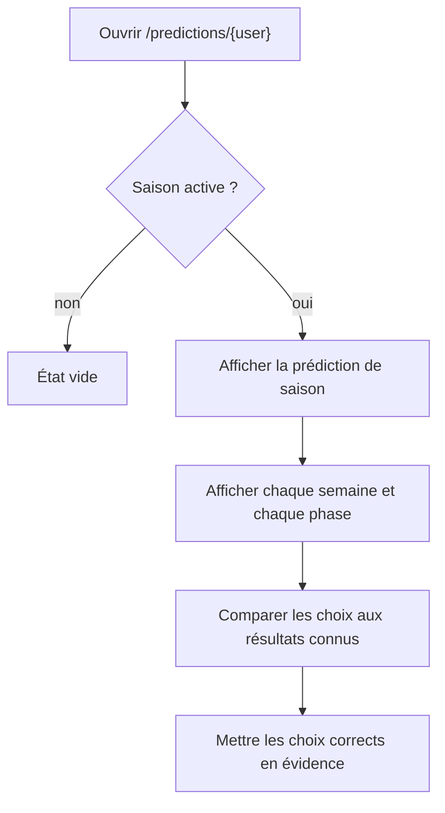

# Consulter les prédictions d’un participant

**Acteur** : tout utilisateur authentifié.

**Entrées** : cartes de statistiques du tableau de bord ou classement.

## Parcours

## Données

- Les semaines chargent leurs phases et résultats.
- Les prédictions chargent leur score, mais l’interface montre surtout les choix et leur exactitude visuelle.
- L’affichage sait encore interpréter les anciens payloads de prédiction.

## Écarts UX et équité observés

- Aucun contrôle ne masque les brouillons ou prédictions non confirmées aux autres participants.
- Aucun contrôle ne diffère la publication jusqu’au verrouillage de la semaine; des choix encore modifiables peuvent donc être consultés.
- La prédiction de saison non confirmée est également visible.
- Le détail charge toutes les semaines d’un coup et répète beaucoup de logique métier de normalisation dans le composant de présentation.
- Le score chiffré et son détail ne sont pas exposés, malgré la relation `score` chargée.

## Sources et couverture

- `routes/web.php`, route `predictions.show` protégée uniquement par `auth`.
- `resources/views/livewire/predictions/⚡show/`.
- `tests/Feature/PredictionsShowTest.php`.

