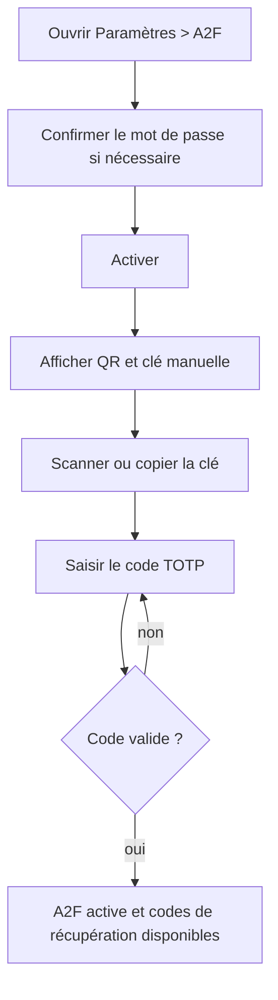

# Gérer l’authentification à deux facteurs

**Acteur** : utilisateur authentifié ayant récemment confirmé son mot de passe.

## Activation

## Gestion ultérieure

- Afficher ou masquer les codes de récupération.
- Régénérer tous les codes.
- Désactiver l’A2F.
- À la prochaine connexion, utiliser un TOTP ou un code de récupération.

## Écarts UX et sécurité observés

- La désactivation est immédiate, sans confirmation secondaire.
- La régénération invalide les anciens codes sans dialogue de confirmation ni possibilité de copie groupée/téléchargement.
- Seule la liste des codes a un effet `wire:loading`; les actions principales ne sont pas désactivées pendant la requête.
- Le bouton de copie de la clé manuelle est un bouton HTML sans libellé accessible explicite.

## Sources et couverture

- `resources/views/livewire/settings/⚡two-factor/`.
- `resources/views/livewire/settings/two-factor/⚡recovery-codes/`.
- `config/fortify.php`.
- `tests/Feature/Settings/TwoFactorAuthenticationTest.php`.

