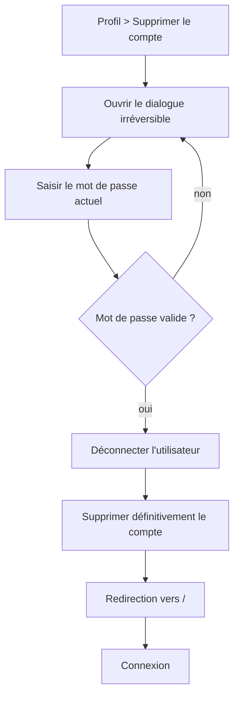

# Supprimer son compte

**Acteur** : utilisateur authentifié.

## Parcours

## Effets

- Le compte est supprimé avec `forceDelete`, contrairement à la suppression administrative qui est logique.
- Les relations configurées avec suppression en cascade retirent prédictions et scores associés.

## Écarts UX observés

- Le dialogue affirme supprimer « toutes les ressources », mais les fichiers d’avatar du stockage ne sont pas explicitement supprimés.
- Aucun état de chargement sur l’action irréversible.
- Le bouton Annuler n’indique pas explicitement `type="button"`; il dépend du rendu du composant Flux pour ne pas soumettre le formulaire.
- Aucun export des données ou délai de récupération n’est proposé avant la suppression.

## Sources et couverture

- `resources/views/livewire/settings/⚡delete-user-form/`.
- `app/Http/Requests/Settings/DeleteUserRequest.php`.
- `tests/Feature/Settings/ProfileUpdateTest.php`.

