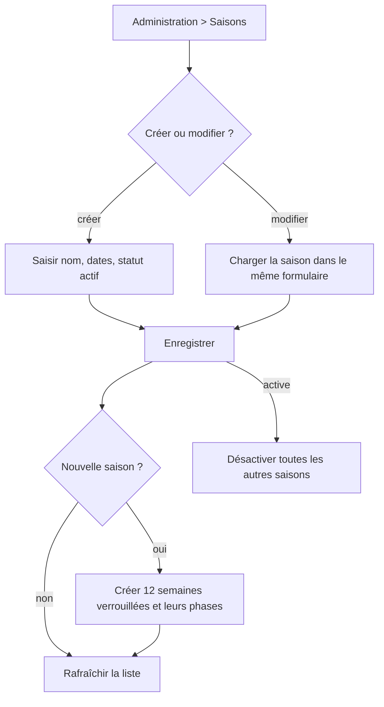

# Administrateur — gérer les saisons

**Acteur** : administrateur.

## Parcours

## Suppression

- Un dialogue affiche le nom et l’étendue de la suppression.
- La suppression en cascade retire semaines, candidats, prédictions, résultats et scores.

## Écarts UX et métier observés

- Création/activation/désactivation ne sont pas regroupées dans une transaction.
- Les dates ne garantissent pas que la fin est postérieure au début.
- Les 12 semaines sont générées depuis le second dimanche de janvier de l’année, pas depuis la vraie date de début saisie.
- Le formulaire n’indique pas s’il édite ou crée et n’offre pas de bouton Annuler explicite.
- Aucune confirmation n’est demandée avant de basculer la saison active, opération qui change tout le contexte utilisateur.
- Les caches des saisons anciennement ou nouvellement actives ne sont pas invalidés centralement.

## Sources et couverture

- `resources/views/livewire/admin/seasons/⚡index/`.
- `app/Actions/Seasons/CreateDefaultWeeks.php`.
- `tests/Feature/AdminSeasonCreatesWeeksTest.php`, `AdminDeleteSeasonTest.php`.

