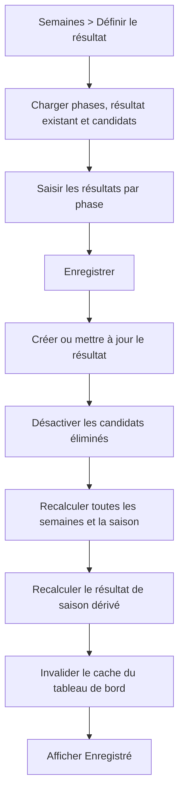

# Administrateur — enregistrer le résultat d’une semaine

**Acteur** : administrateur.

## Parcours actuel

## Écarts UX et intégrité observés

- L’opération multi-étapes est synchrone et non transactionnelle; le bouton n’indique ni progression ni blocage.
- Corriger l’éliminé ajoute une désactivation, mais ne reconstruit pas les statuts actifs; l’ancien éliminé reste inactif.
- Le résultat de saison dérivé n’efface pas les valeurs devenues invalides et suppose que le premier éliminé appartient à la semaine 1.
- Les scores incluent aussi les brouillons non confirmés.
- Un échec de recalcul peut survenir après l’enregistrement visible du résultat.
- Aucun résumé du nombre de scores qui seront modifiés ni confirmation avant une correction historique.

## Sources et couverture

- `resources/views/livewire/admin/weeks/⚡outcome/`.
- `app/Actions/Predictions/RecalculateAllScores.php`.
- `app/Actions/Seasons/CalculateSeasonOutcomeFromWeekOutcomes.php`.
- `tests/Feature/AdminWeekOutcomeDeactivatesEvictedHouseguestTest.php`, `AdminWeekOutcomeCanSaveWhenVetoNotUsedTest.php`.

