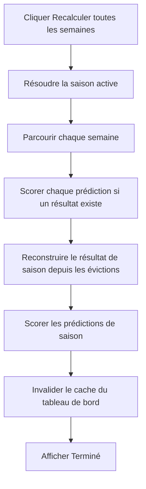

# Administrateur — recalculer tous les scores

**Acteur** : administrateur.

**Entrée** : bloc affiché sur le tableau de bord.

## Parcours

## Écarts UX et exploitation observés

- Tout s’exécute dans la requête Livewire; le temps augmente avec semaines × participants.
- Aucun état de progression, désactivation du bouton, date de dernier calcul ou rapport d’erreurs.
- Des clics concurrents peuvent lancer plusieurs recalculs.
- Les brouillons sont scorés car les requêtes ne filtrent pas les confirmations.
- Une semaine sans résultat retourne immédiatement sans supprimer un score précédemment calculé devenu obsolète.
- Le service accepte un administrateur, mais cette information n’est pas persistée dans les scores.

## Sources et couverture

- `resources/views/livewire/admin/⚡recalculate/`.
- `app/Actions/Predictions/RecalculateAllScores.php`, `ScoreWeek.php`, `ScoreSeasonPredictions.php`.
- `tests/Feature/AdminRecalculateScoresAllWeeksCalculatesSeasonScoresTest.php`, `AdminRecalculateScoresSeasonPredictionsTest.php`.

