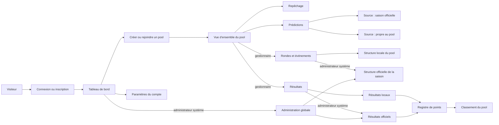

# Cartographie des parcours actuels

Cette cartographie décrit le comportement observé dans les routes, les composants Livewire, les actions métier et les tests. Elle suit l’architecture actuelle centrée sur les pools.

Chaque guide utilise le même canevas : acteur, préconditions et autorisations, parcours, règles et états terminaux, limites vérifiées, puis sources et couverture de tests.

## Accès

1. [Accueil, connexion et déconnexion](acces/accueil-connexion-deconnexion.md)
2. [Inscription et vérification du courriel](acces/inscription-verification-courriel.md)
3. [Récupération du mot de passe](acces/recuperation-mot-de-passe.md)
4. [Challenge de connexion A2F](acces/challenge-connexion-a2f.md)

## Compte

1. [Modifier le profil](compte/profil.md)
2. [Modifier le mot de passe](compte/mot-de-passe.md)
3. [Choisir l’apparence](compte/apparence.md)
4. [Gérer l’authentification à deux facteurs](compte/authentification-deux-facteurs.md)
5. [Supprimer son compte](compte/suppression-compte.md)

## Pools

1. [Consulter le tableau de bord](pools/tableau-de-bord.md)
2. [Créer ou rejoindre un pool](pools/creer-rejoindre-pool.md)
3. [Consulter et gérer le cycle de vie d’un pool](pools/vue-ensemble-cycle-de-vie.md)
4. [Participer au repêchage](pools/repechage.md)
5. [Saisir et visualiser les prédictions](pools/predictions.md)
6. [Gérer les rondes et événements](pools/rondes-evenements.md)
7. [Saisir et publier les résultats](pools/resultats.md)
8. [Consulter le classement](pools/classement.md)

Les trois écrans fonctionnels sont volontairement distincts :

- `pools.events` gère la structure des rondes et événements, sans formulaire de prédiction ni de résultat;
- `pools.predictions` réunit les événements de la saison officielle et ceux propres au pool qui acceptent des prédictions;
- `pools.results` regroupe la saisie et l’historique des résultats locaux et, pour un administrateur système, les résultats officiels de la saison.

## Administration

1. [Gérer les saisons](administration/saisons.md)
2. [Gérer les candidats](administration/candidats.md)
3. [Gérer les utilisateurs](administration/utilisateurs.md)
4. [Configurer les types d’événements standards](administration/types-evenements-standards.md)
5. [Créer, modifier, supprimer et piloter les rondes et événements officiels](administration/rondes-evenements-officiels.md)
6. [Saisir, prévisualiser, publier, corriger et reprendre les résultats officiels](administration/resultats-officiels.md)

## Carte globale

## Couverture des routes applicatives

| Zone | Routes actuelles |
|---|---|
| Accueil | `home`, `dashboard` |
| Compte | `profile.edit`, `user-password.edit`, `appearance.edit`, `two-factor.show` |
| Pools | `pools.index`, `pools.show`, `pools.draft`, `pools.predictions`, `pools.events`, `pools.results`, `pools.leaderboard` |
| Redirections administratives contextuelles | `pools.official-rounds` redirige vers `pools.events`; `pools.official-results` redirige vers `pools.results` |
| Administration globale | `admin.seasons.index`, `admin.event-types`, `admin.official-rounds`, `admin.official-results`, `admin.houseguests.index`, `admin.users.index` |

Les routes d’authentification, d’inscription, de vérification du courriel et de récupération du mot de passe sont enregistrées par Fortify. Les deux redirections contextuelles officielles restent protégées par l’autorisation administrateur; elles préservent les anciens favoris sans recréer de pages parallèles.

## Sources principales

- `routes/web.php`
- `config/fortify.php`
- `resources/views/components/pools/`
- `resources/views/components/admin/`
- `resources/views/livewire/`
- `app/Actions/`
- `app/Http/Requests/`
- `app/Models/`
- `tests/Feature/`
