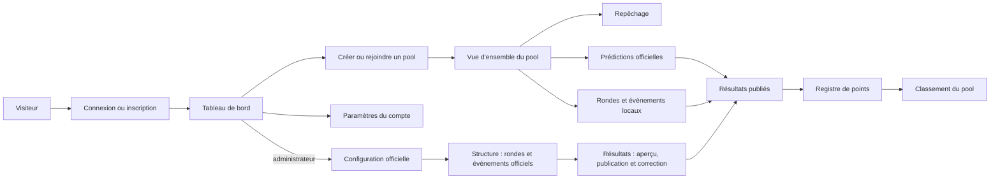

# Cartographie des parcours actuels

Cette cartographie décrit le comportement observé dans les routes, les composants Livewire, les actions métier et les tests. Elle suit l’architecture actuelle centrée sur les pools.

Chaque guide utilise le même canevas : acteur, préconditions et autorisations, parcours, règles et états terminaux, limites vérifiées, puis sources et couverture de tests.

## Accès

1. [Accueil, connexion et déconnexion](acces/accueil-connexion-deconnexion.md)
2. [Inscription et vérification du courriel](acces/inscription-verification-courriel.md)
3. [Récupération du mot de passe](acces/recuperation-mot-de-passe.md)
4. [Challenge de connexion A2F](acces/challenge-connexion-a2f.md)

## Compte

1. [Modifier le profil](compte/profil.md)
2. [Modifier le mot de passe](compte/mot-de-passe.md)
3. [Choisir l’apparence](compte/apparence.md)
4. [Gérer l’authentification à deux facteurs](compte/authentification-deux-facteurs.md)
5. [Supprimer son compte](compte/suppression-compte.md)

## Pools

1. [Consulter le tableau de bord](pools/tableau-de-bord.md)
2. [Créer ou rejoindre un pool](pools/creer-rejoindre-pool.md)
3. [Consulter et gérer le cycle de vie d’un pool](pools/vue-ensemble-cycle-de-vie.md)
4. [Participer au repêchage](pools/repechage.md)
5. [Soumettre les prédictions officielles](pools/predictions.md)
6. [Gérer les rondes et événements locaux](pools/rondes-evenements-resultats.md)
7. [Consulter le classement](pools/classement.md)

Le parcours `pools.predictions` regroupe uniquement les événements officiels synchronisés dans un pool. Les prédictions liées aux événements locaux sont saisies dans `pools.events` et sont donc documentées avec la gestion des rondes et événements du pool.

## Administration

1. [Gérer les saisons](administration/saisons.md)
2. [Gérer les candidats](administration/candidats.md)
3. [Gérer les utilisateurs](administration/utilisateurs.md)
4. [Configurer les types d’événements standards](administration/types-evenements-standards.md)
5. [Créer, modifier, supprimer et piloter les rondes et événements officiels](administration/rondes-evenements-officiels.md)
6. [Saisir, prévisualiser, publier, corriger et reprendre les résultats officiels](administration/resultats-officiels.md)

## Carte globale

## Couverture des routes applicatives

| Zone | Routes actuelles |
|---|---|
| Accueil | `home`, `dashboard` |
| Compte | `profile.edit`, `user-password.edit`, `appearance.edit`, `two-factor.show` |
| Pools | `pools.index`, `pools.show`, `pools.draft`, `pools.predictions`, `pools.events`, `pools.official-rounds`, `pools.official-results`, `pools.leaderboard` |
| Administration | `admin.seasons.index`, `admin.event-types`, `admin.official-rounds`, `admin.official-results`, `admin.houseguests.index`, `admin.users.index` |

Les routes d’authentification, d’inscription, de vérification du courriel et de récupération du mot de passe sont enregistrées par Fortify.
Les routes `pools.official-rounds` et `pools.official-results` sont les accès administratifs affichés dans la navigation d’un pool et restent figées sur sa saison. Les routes globales `admin.official-rounds` et `admin.official-results` sont conservées comme accès direct de secours, notamment avant qu’un pool existe.

## Sources principales

- `routes/web.php`
- `config/fortify.php`
- `resources/views/components/pools/`
- `resources/views/components/admin/`
- `resources/views/livewire/`
- `app/Actions/`
- `app/Http/Requests/`
- `app/Models/`
- `tests/Feature/`
