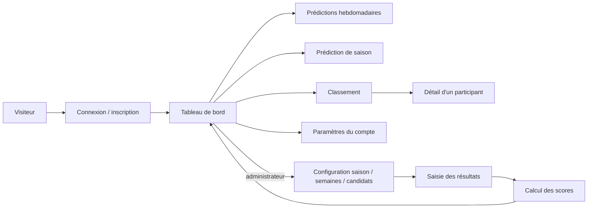

# Cartographie des parcours

Cette cartographie décrit le comportement observé dans les routes, les composants Livewire, les actions métier et les tests. Chaque parcours est isolé dans un fichier afin de pouvoir le faire évoluer et le tester indépendamment.

## Légende

- **Acteur** : personne qui déclenche le parcours.
- **Préconditions** : état nécessaire avant l’entrée dans le parcours.
- **État terminal** : résultat visible ou persistant attendu.
- **Écart UX** : friction ou risque constaté dans l’implémentation actuelle.
- **Couverture** : tests qui prouvent actuellement une partie du parcours.

## Parcours publics et d’accès

1. [Accueil, connexion et déconnexion](01-accueil-connexion-deconnexion.md)
2. [Inscription et vérification de l’adresse courriel](02-inscription-verification-courriel.md)
3. [Récupération du mot de passe](03-recuperation-mot-de-passe.md)
4. [Challenge de connexion A2F](04-challenge-connexion-a2f.md)

## Parcours participant

5. [Consulter le tableau de bord](05-consulter-tableau-de-bord.md)
6. [Atteindre la semaine courante](06-atteindre-semaine-courante.md)
7. [Saisir et confirmer une prédiction hebdomadaire](07-prediction-hebdomadaire.md)
8. [Saisir et confirmer une prédiction de saison](08-prediction-saison.md)
9. [Consulter le classement](09-consulter-classement.md)
10. [Consulter les prédictions d’un participant](10-consulter-predictions-participant.md)
11. [Modifier le profil](11-modifier-profil.md)
12. [Modifier le mot de passe](12-modifier-mot-de-passe.md)
13. [Choisir l’apparence](13-choisir-apparence.md)
14. [Gérer l’authentification à deux facteurs](14-gerer-a2f.md)
15. [Supprimer son compte](15-supprimer-son-compte.md)

## Parcours administrateur

16. [Gérer les saisons](16-admin-gerer-saisons.md)
17. [Configurer les semaines et leurs phases](17-admin-configurer-semaines.md)
18. [Gérer les candidats](18-admin-gerer-candidats.md)
19. [Enregistrer le résultat d’une semaine](19-admin-resultat-semaine.md)
20. [Enregistrer le résultat de saison](20-admin-resultat-saison.md)
21. [Gérer les utilisateurs](21-admin-gerer-utilisateurs.md)
22. [Corriger une prédiction](22-admin-corriger-prediction.md)
23. [Recalculer tous les scores](23-admin-recalculer-scores.md)

## Carte globale

## Sources principales

- `routes/web.php`
- `config/fortify.php`
- `resources/views/livewire/`
- `app/Actions/`
- `app/Http/Requests/`
- `app/Models/`
- `tests/Feature/`

